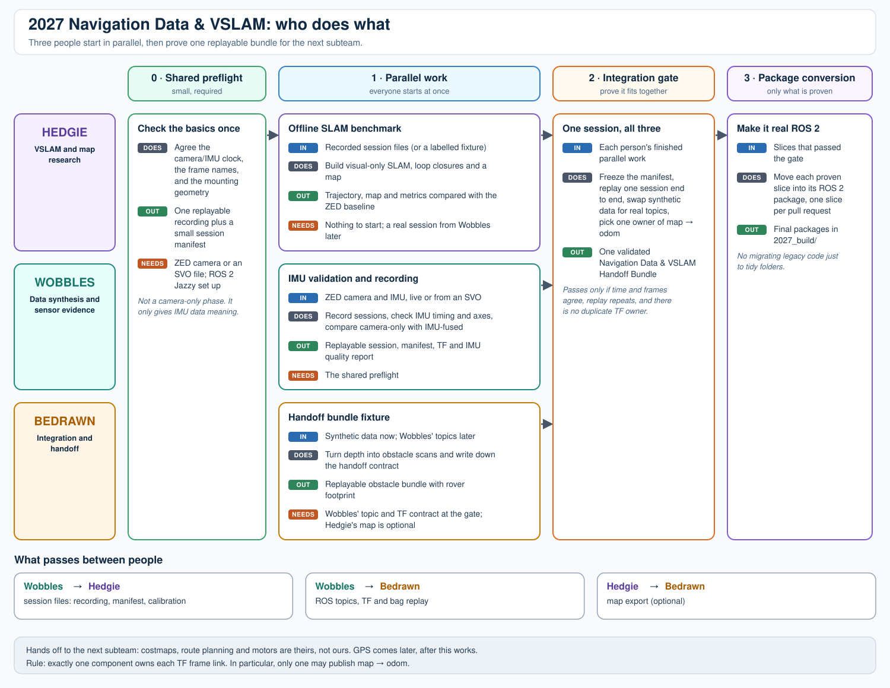

# 2027 Autonomous Navigation Build

This folder is the planning contract for the Ubuntu 24.04 / ROS 2 Jazzy build. The existing top-level Python pipeline remains a standalone ZED prototype and is not the ROS 2 navigation stack.

## Start here

New to this project? Read `FOUNDATIONS.md` first. It explains, in plain language, what the current ZED prototype does, what its outputs mean, why a ZED area map is not yet a Nav2 map, and why `2027_build/` belongs at the repository root.

Then read this file, your person-specific plan, and finally `DOCS.md` for the detailed legacy implementation reference.

## At a glance: who does what, and where data comes from



Open [pipeline.svg](pipeline.svg) directly in any browser or editor for full size; it is a self-contained file and works offline.

How to read it:

- **Lanes** are people. **Columns** are phases (camera-only, then IMU, then GPS); dashed boxes are later phases.
- Every box lists its **IN** and **OUT**. The colored chip says where the input comes from: **red = live hardware**, **green = recorded files/replay**, **grey = synthetic or fixture**, **brown = measured by hand**.
- Wobbles is the data hub. Its **session folder** feeds Hedgie, and its **ROS topics/bag replay** feed Bedrawn. Until those exist, Hedgie uses a fixture and Bedrawn uses synthetic messages, so nobody is blocked.
- The only Hedgie → Bedrawn link is the optional offline map export (dashed purple).
- The bottom of the diagram lists the five points where all three must sync, and the TF rule (one publisher per arrow).

## Baseline

`main.py` already opens the ZED, retrieves RGB and depth, runs ZED positional tracking with IMU fusion, records SVO, writes a TUM trajectory, persists a ZED area map, and runs YOLO plus depth heuristics. It does **not** yet publish ROS 2 messages, create Nav2 maps/costmaps, or provide GPS localization.

The target runtime is Ubuntu 24.04 with ROS 2 Jazzy. Ubuntu 20.04/Foxy is not a target. Hardware compatibility, NVIDIA driver/CUDA, the ZED SDK, and the current ZED ROS 2 wrapper must be verified together before live deployment.

### The simple mental model

The old program is one camera application. The new build is a ROS 2 workspace that lets independent components exchange standardized data:

```text
camera data -> localization/map/perception outputs -> Nav2 -> future motor interface
```

The 2027 build does **not** throw away the old program. It keeps it as a replayable baseline while the ROS 2 workspace grows beside it.

## Local branch baseline

All branches start from `main` after the documentation commit.

| Person  | Branch                          | Primary package area                       | May proceed independently with                    |
| ------- | ------------------------------- | ------------------------------------------ | ------------------------------------------------- |
| Hedgie  | `hedgie-slam-research`        | offline visual SLAM and semantic mapping   | recorded SVO/extracted session folders            |
| Wobbles | `wobbles-sensor-localization` | ZED/IMU/GPS and localization data contract | live camera or an SVO; no Nav2 dependency         |
| Bedrawn | `bedrawn-nav-integration`     | maps, costmaps, Nav2, simulation/replay    | synthetic ROS bags or Wobbles bags when available |

Read the person-specific plans before editing. A merge is not required for another workstream to begin.

## Shared end-state contract

```text
map -> odom -> base_link -> camera_link -> imu_link
                  |
                  +-> Nav2 local/global costmaps -> planner/controller

Recorded session -> Hedgie offline SLAM/map research
ZED / IMU / GPS -> Wobbles localization data contract
Map + obstacle representation -> Bedrawn Nav2 integration
```

Exactly one component must own each TF edge. In particular, do not let ZED positional tracking, SLAM Toolbox, AMCL, and a GPS filter simultaneously publish `map -> odom`.

## Build order

1. Camera-only: ZED RGB-D/VIO, replayable recordings, offline SLAM benchmark, depth-derived obstacle representation, Nav2 simulation/replay.
2. IMU: timestamp/axis validation, VIO comparison, local state-estimation decision.
3. GPS: GNSS quality/heading validation, a single global-localization owner, outdoor waypoint validation.

No live motor command is an acceptance criterion for this repository. First prove the stack through RViz and replay/simulation.

## 2027 workspace target

`2027_build/` should be a **new directory at the repository root**. Implementation branches may add this workspace without modifying the legacy pipeline:

```text
2027_build/
  src/
    rover_camera_ai/
    rover_localization/
    rover_navigation/
    rover_bringup/
  config/
  evaluation/
```

Package names must remain valid ROS 2 names; `2027_build` is only a directory name.

The generated ROS directories `2027_build/build/`, `2027_build/install/`, and `2027_build/log/` must stay out of Git. Only source, configuration, tests, and small reproducible fixtures belong in the repository.

## Shared data handoff

Every recorded session should ultimately have a stable identifier and this minimum manifest:

- camera model, serial (or anonymized device id), resolution, FPS, and intrinsics;
- coordinate convention and static `base_link -> camera_link` transform;
- SVO path/checksum and matching rosbag2 path/checksum when available;
- start/end timestamps, recording software versions, and calibration version;
- pose/tracking status timeline, IMU availability, and GPS availability;
- the test route, environment, and known failure events.

The schema may be drafted independently, but Wobbles owns its final live-data implementation. Hedgie can use a synthetic or hand-authored manifest while waiting.

## Reference docs: what to use and when

- [ZED ROS 2 overview](https://docs.stereolabs.com/docs/integrations/ros-2): start here for the supported Ubuntu 24.04/Jazzy path, wrapper packages, SVO replay, diagnostics, and the available RGB/depth/point-cloud/IMU/VIO outputs.
- [ZED robot integration](https://docs.stereolabs.com/docs/integrations/ros-2/robot-integration): consult before defining the rover URDF or choosing how ZED positional tracking coexists with other localization sources.
- [ZED positional tracking in ROS 2](https://docs.stereolabs.com/docs/integrations/ros-2/positional-tracking): use it to understand the difference between `odom`, globally corrected `pose`, paths, tracking confidence, and area-map relocalization.
- [Nav2 first-time robot setup](https://docs.nav2.org/rolling/configuration_and_development/first_time_robot_setup_guide/): consult before adding navigation packages; it orders the prerequisites as transforms, URDF, odometry, sensors, mapping/localization, footprint, then navigation plugins.
- [Nav2 mapping and localization](https://docs.nav2.org/rolling/configuration_and_development/first_time_robot_setup_guide/sensors/mapping_localization/): use it for the initial `slam_toolbox`/costmap model, not as a drop-in parameter file.
- [Nav2 navigation plugins](https://docs.nav2.org/rolling/configuration_and_development/navigation_plugins/): use this as a catalog after the basic stack works. It helps decide whether a standard planner/controller/layer already solves a need; it is not a reason to write custom plugins first.
- [Nav2 GPS localization](https://docs.nav2.org/rolling/tutorials/general_tutorials/navigation2_with_gps/navigation2_with_gps/): use only for the GPS stage. Focus on TF ownership, uncertainty, heading, and the role of `navsat_transform`.
